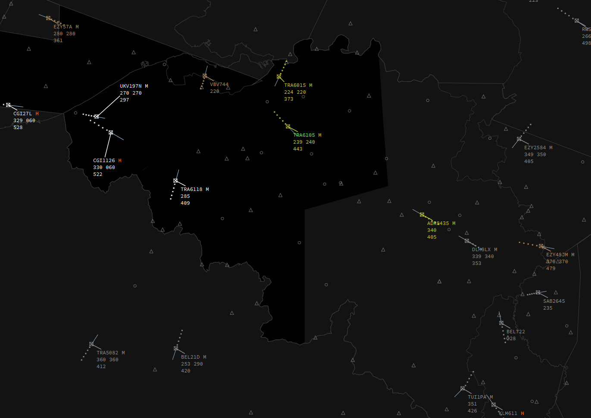
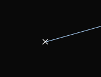
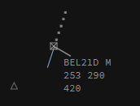
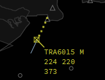
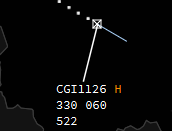
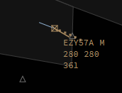
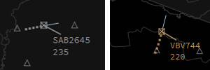

#Airborne Labels

##General knowledge

For airborne traffic there is a set off different labels per situation.
These are:

* Airborne psr (sqwk SBY)
* Airborne default (default airborne label)
* Airborne concerned (label when your sector has been set NEXT)
* Airborne assumed (assumed label)
* Airborne released (released label)
* Airborne filtered (label when filter is active)

##Airborne psr

Airborne psr only shows you the target without any data or label. This means the target has his transponder in mode standby.

##Airborne default

Airborne default is the label which is shown if the traffic is not assumed, nor concerned, nor released.

##Airborne concerned

The Airborne concerned label will be shown when you are the NEXT sector (must be specified by you or by the controller who assumed the target via the NEXT field).

##Airborne assumed

Airborne assumed label will be shown when you have assumed a target, meaning you are the current controller of that target.

##Airborne released

Airborne released will be shown when you have released or transfered a target.

##Airborne filtered

Airborne filtered can be *Airborne default* or *Airborne released* but will show less info if it falls under the filter limits set via the filter function.

##Label Fields

###Default, assumed, concerned and released

The *normal label* shows us basic info such as callsign, wake turbulence category, actual level, climb/descent arrow, cleared level, rate of climb/descent in ft/min and groundspeed.

The *extended label* shows us more infomration consisting of:

* Line 1
    * **Callsign** - the *callsign*, left and right click on the callsign will open the _callsignmenu_, double clicking it will transfer it to the ATC Station selected in the **NEXT** field;
    * **Current assumed sector** - this field shows you who is in command of the aircraft. it will show you the "short ID" of that station. Left and right click open the *NEXT menu*, double click sets yourself as *NEXT*
    * **Aircraft type** - used to indicate what aircraft type the target is, no click actions;
    * **WTC** - the *wake turbulence category*, indicates what wake turbulence category the target is, this can be L (Light), M (Medium), H (Heavy) or J (Super). No click actions;
    * **Transmitted Mode A code** - this field shows the Mode A code the pilot has entered in his transponder;
* Line 2	
	* **Actual level** - the actual altitude shown as flight level, of the aircraft;
	* **climb/descent arrow** - indicates if the aircraft is climbing or descending;
	* **Cleared level** - the cleared altitude, expressed in flight level, of the aircraft, left click opens the *level selector menu*;
	* **Rate of climb/descent** - shows the climb/descent rate in feet/min, formatted to show hundreds of feet (700ft/min will be shown as 7, -1200ft/min will be shown as -12);
	* **Arrival runway** - used to select the arrival runway of the target. Left click opens the *runway selector menu*;
	* **Arrival gate** - used to select the arrival gate of the target. Left click opens the *arrival gate selector menu*;
* Line 3
	* **Ground speed** - the actual ground speed of the target in knots;
	* **Assigned Speed** - the assigned speed for the target in knots. Left click opens the *speed selector menu*;
	* **Cleared Waypoint** - shows the cleared waypoint/heading. Left click opens the *cleared waypoint selector menu*;
	* **SID** - shows the assigned SID for the target. Left click opens the *SID selector menu*;
	* **STAR** - shows the assigned STAR for the target. Left click opens the *STAR selector menu*;
	* **Requested Flight Level** - shows the requested flight level of the target as filed in the flightplan. Left click to *Set Requested Flight Level*;
* Line 4
	* **Departure Aerodrome** - shows the filed departure aerodrome of the target. **Left click** opens/closes the *flightplan window*, **right click** activates/deactivates *extrapolate* for the target and **double click** activates/deactivates the *track function* of the target;
	* **Sector entry cleared waypoint (COPN)** - (coordinated) waypoint in which the target will enter the next sector. Left click to *Set coordinated entry point*, right click activates/deactivates *extrapolate* for the target;
	* **XCOP** - The eXit Co-Ordination Point, the waypoint at which the target is planned to leave your sector, left click to edit;
	* **Sector entry level (PEL)** - (coordinated) level to enter your sector in flight level. Left click to set *Planned Entry Level*;
	* **XFL**  - The eXit Flight Level, the flight-level at which the target is planned to leave your sector, left click to edit;
	* **Destination aerodrome** - shows the filed destination aerodrome of the target. **Left click** opens/closes the *flightplan window*, **right click** activates/deactivates *extrapolate* for the target;
* Line 5
	* **OP_TEXT** - in this field you can write whatever *Operational Text* you think is important for you or other controllers to know. This could be for instance "newbie". You can access it via left click.

###Filtered

The *extended label* is the same as the *normal label* for filtered targets and consists of the following details:

* Line 1
    * **Callsign** - the *callsign*, left and right click on the callsign will open the _callsignmenu_, double clicking it will *assume* the target;
* Line 2	
	* **Actual level** - the actual altitude shown as flight level, of the aircraft;
	* **climb/descent arrow** - indicates if the aircraft is climbing or descending.