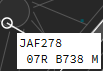

#Ground Labels
##General knowledge

As explained before, there are several labels for ground traffic.
These are:

* Ground Default
* Ground Departure traffic
* Ground Arrival traffic

##Default

The default Ground Label shows a white label background with black text. This label is used for 2 situations:

1. The aircraft did not send a flightplan;
2. The aircraft is a local flight (departure and arrival are the same airport)

##Departure

The Departure Ground Label shows a cyan label background with black text.

##Arrival

The Arrival Ground Label shows a green label background with white text.