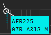

#Ground Labels
##General knowledge

As explained before, there are several labels for ground traffic.
These are:

* Ground Default
* Ground Departure traffic
* Ground Arrival traffic

##Default

The default Ground Label shows a white label background with black text. This label is used for 2 situations:

1. The aircraft did not send a flightplan;
2. The aircraft is a local flight (departure and arrival are the same airport)

###Label Fields

| Normal        | Extended      |
| ------------- |---------------| 
|       |   |

The *normal label* shows us basic info such as callsign, aircraft type and wake turbulence category.

The *extended label* shows us more infomration consisting of:

* **BEL320** - the *callsign*, left and right click on the callsign will open the _callsignmenu_, double clicking it will transfer it to the ATC Station selected in the **NEXT** field;
* **AGATE** - used to specify the GATE to which and aircraft is instructed to taxi to, left click opens a text input window where you can write the gate number;
* **RWY** - used to specify the *runway* the aircraft is assigned to (can be for arrival and departure), left click opens a text input window where you can enter the runway.
* **A320** - the *aircraft type*, used to indicate what aircraft type the target is, no click actions;
* **M** - the *wake turbulence category*, indicates what wake turbulence category the target is, this can be L (Light), M (Medium), H (Heavy) or J (Super). No click actions;
* **SID** - this field shows the selected SID for that aircraft. Clicking on the SID field will open the DataLink Clearance window (DCL);
* **/CFL** - this field shows the cleared Flight Level, clicking on it will open the Cleared Flight Level window on which you can select or type the cleared flight level;
* **OP_TEXT** - in this field you can write whatever *Operational Text* you think is important for you or other controllers to know. This could be for instance "newbie". You can access it via left click;
* **SI** - this field shows you who is in command of the aircraft. it will show you the "short ID" of that station. So if EBBR_N_TWR (short ID BR25R) would have assumed the aircraft, the SI would show BR25R. Left and right click opens the *NEXT window*, double click will set yourself as NEXT controller.
* **NEXT** - this field tells you who will be the next controller. If you are EBBR_APP and the next controller would be EBBR_N_TWR, you should select EBBR_N_TWR (BR25R) as NEXT. The use of NEXT is very important as this also changes label states such as concerned and it allows you to transfer the traffic by double clicking the callsign. The NEXT field also manipulates the flight lists, especially the SI (Sector Inbound) flight list.

##Departure

The Departure Ground Label shows a cyan label background with black text.

###Label Fields

| Normal        | Extended      |
| ------------- |---------------| 
|       |   |

The *normal label* shows us basic info such as callsign, aircraft type, wake turbulence category and runway (runway will only be shown when specified in the RWY Field).

The *extended label* shows us more infomration consisting of:

* **BEL320** - the *callsign*, left and right click on the callsign will open the _callsignmenu_, double clicking it will transfer it to the ATC Station selected in the **NEXT** field;
* **RWY** - used to specify the *runway* the aircraft is assigned to (can be for arrival and departure), left click opens a text input window where you can enter the runway.
* **A320** - the *aircraft type*, used to indicate what aircraft type the target is, no click actions;
* **M** - the *wake turbulence category*, indicates what wake turbulence category the target is, this can be L (Light), M (Medium), H (Heavy) or J (Super). No click actions;
* **SID** - this field shows the selected SID for that aircraft. Clicking on the SID field will open the DataLink Clearance window (DCL);
* **/CFL** - this field shows the cleared Flight Level, clicking on it will open the Cleared Flight Level window on which you can select or type the cleared flight level;
* **OP_TEXT** - in this field you can write whatever *Operational Text* you think is important for you or other controllers to know. This could be for instance "newbie". You can access it via left click;
* **EGPH** - this field shows you the *destination airport* of the aircraft, in this example EGPH. Left click on this field opens the *Flightplan Window*, right click will show you the *Extrapolated Route*.
* **SI** - this field shows you who is in command of the aircraft. it will show you the "short ID" of that station. So if EBBR_N_TWR (short ID BR25R) would have assumed the aircraft, the SI would show BR25R. Left and right click opens the *NEXT window*, double click will set yourself as NEXT controller.
* **NEXT** - this field tells you who will be the next controller. If you are EBBR_APP and the next controller would be EBBR_N_TWR, you should select EBBR_N_TWR (BR25R) as NEXT. The use of NEXT is very important as this also changes label states such as concerned and it allows you to transfer the traffic by double clicking the callsign. The NEXT field also manipulates the flight lists, especially the SI (Sector Inbound) flight list.

##Arrival

The Arrival Ground Label shows a green label background with white text.

###Label Fields

| Normal        | Extended      |
| ------------- |---------------| 
|       |   |

The *normal label* shows us basic info such as callsign, aircraft type, wake turbulence category and Gate (gate will only be shown when specified in the GATE Field).

The *extended label* shows us more infomration consisting of:

* **BEL320** - the *callsign*, left and right click on the callsign will open the _callsignmenu_, double clicking it will transfer it to the ATC Station selected in the **NEXT** field;
* **GATE** - used to specify the GATE to which and aircraft is instructed to taxi to, left click opens a text input window where you can write the gate number;
* **A320** - the *aircraft type*, used to indicate what aircraft type the target is, no click actions;
* **M** - the *wake turbulence category*, indicates what wake turbulence category the target is, this can be L (Light), M (Medium), H (Heavy) or J (Super). No click actions;
* **OP_TEXT** - in this field you can write whatever *Operational Text* you think is important for you or other controllers to know. This could be for instance "newbie". You can access it via left click;
* **SI** - this field shows you who is in command of the aircraft. it will show you the "short ID" of that station. So if EBBR_N_TWR (short ID BR25R) would have assumed the aircraft, the SI would show BR25R. Left and right click opens the *NEXT window*, double click will set yourself as NEXT controller.
* **NEXT** - this field tells you who will be the next controller. If you are EBBR_APP and the next controller would be EBBR_N_TWR, you should select EBBR_N_TWR (BR25R) as NEXT. The use of NEXT is very important as this also changes label states such as concerned and it allows you to transfer the traffic by double clicking the callsign. The NEXT field also manipulates the flight lists, especially the SI (Sector Inbound) flight list.
* **LEMD** - this field shows you the *departure airport* of the aircraft, in this example LEMD. Right click will show you the *Extrapolated Route*.