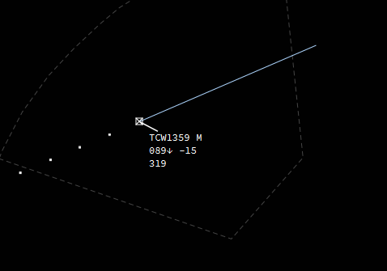

#Labels
##General knowledge

IVAC2 offers the possibility to customise the labels in many levels. So this part of documentation is very important and quite a big chunk to go through.

When using IVAC2 you will notice pretty fast that you will have more or lees details in a label depending if you hover over it or not. When you hover over a label you will see it extends and shows you more information about that flight. This is called the _extended label_.

Next to that you will have different labels for different stages of the flight which we will explain in detail.

The labels have been designed to match the CANAC2 system used at Belgocontrol.

##What types of labels are there?

As said above, the labels differ per flight stage and type (VFR, IFR, concerned, and so on).

In the EBBU FIRDEF we have 2 sets of labels, one for airborne traffic and one for traffic on the ground.

###Extended Labels

Here you have an example of the difference between a normal label and an extended one. This works both on airborne as ground traffic. What information is visible in what state will be explained seperatly in their own section.

| Normal        | Extended      |
| ------------- |---------------| 
|       |   |

###Ground Labels

* Ground Default
* Ground Departure traffic
* Ground Arrival traffic

###Airborne labels

* Airborne psr (sqwk SBY)
* Airborne default (default airborne label)
* Airborne concerned (label when your sector has been set NEXT)
* Airborne assumed (assumed label)
* Airborne filtered (label when filter is active)
* Airborne released (released label)

The labels differ completely from IVAC1 so we will explain in detail what each label does.