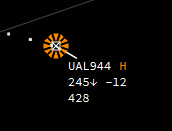

# Label indicators

IVAC2 has a functionality where parts of the label will change a color depending on a cartain state such as *transfer*, *Special Purpose Indicator (ident)*, *next station*, ...

We will sum them up here so you know what each indicator means.

## Special Purpose Indicator

The special purpose indicator, which is used for squawk ident looks like this:

