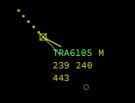
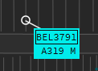
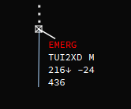
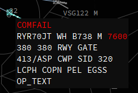
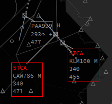
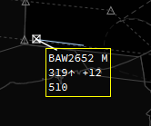
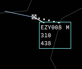
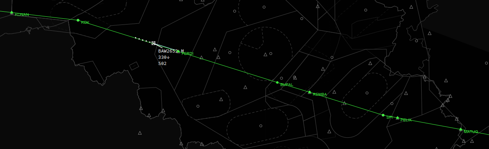
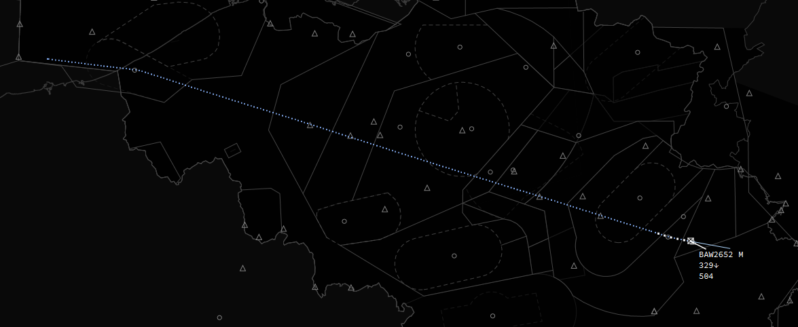

# Label indicators

IVAC2 has a functionality where parts of the label will change a color depending on a cartain state such as *transfer*, *Special Purpose Indicator (ident)*, *next station*, ...

We will sum them up here so you know what each indicator means.

## Transfer Request

Whenever you request a transfer of communications for a target to another sector (=controller) or another sector requests a transfer of communications to you the callsign of that aircraft will turn green.

## Special Purpose Indicator

The special purpose indicator, which is used for squawk ident looks like this:

## Text Only (CPDLC) Indicator

When an aircraft is Text Only (CPDLC in IVAC2) it will show you a rectangle around the callsign. The example below is ground traffic but it works the same for airborne traffic.

When an aircaft is CPDLC only, IVAC2 will translate label inputs such as *cleared waypoint*, *cleared flight level*, *transfer* ... into a CPDLC message to the pilot. In the *cleared flight level* input it will even send a CPDLC when selecting *CA (cleared approach)* and *LA (Land)*. So you won't need to type much yourself anymore.

## Emergency

Whenever an aircraft is in an emergency and has entered 7700 in its transponder, a red *EMERG* will be shown above the callsign and inside the extended label the SQ code will also turn red.

## COMFAIL

Whenever an aircraft has a failure of communications (known as COMFAIL) and has entered 7600 in its transponder, a red *COMFAIL* will be shown above the callsign and inside the extended label the SQ code will also turn red.

## STCA

STCA - Short Term Conflict Advisory. Targets will get a red rectangle around the label if they are less than 1000ft vertically separated and less than 5 miles laterally. A red *STCA* will also be shown above the callsign.

## Point

Inside the *callsignmenu* you can opt to *point* a target.
Targets which are pointed out have a box drawn around their label in a contrasting colour which is visible to **all** controllers using IVAC2. Usefull when you want the next sector to easily find a target for coordination.

## Mark

Inside the *callsignmenu* you can opt to *mark* a target. Usefull when there is something special with that target and you don't want to forget it or lose track of it.
Targets which are marked have a box drawn around their label which is visible just to yourself.

## Extrapolate

Activating extrapolate on a target will show you the *extrapolated* route of that target as filed in the flightplan.

## Track

Activating track on a target will show you the track the aircraft has been flying since you have connected or since the aircraft started moving.

