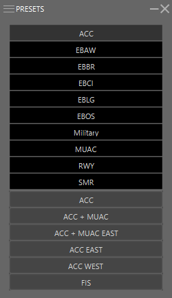

#Presets Introduction

*Unlike the MAPS window, which only switches a single map attribute on or off, making a selection in the PRESETS menu can make multiple changes to the display, including opening INSET windows for specific use.*

Presets are used to define a set of maps which can be linked to an ATC station. These are often linked to a specific ATC Station which can be selected in the *IVAC2 Launcher*.

Presets can also be used to change maps for a certain purpose. In EBBU you can for instance control *Extended Centerline*, you can activate **ALL** easterly Extended Centerlines or **ALL** westerly Extended Centerlines.

We will go more in depth in what each preset does in the *Presets List* page

